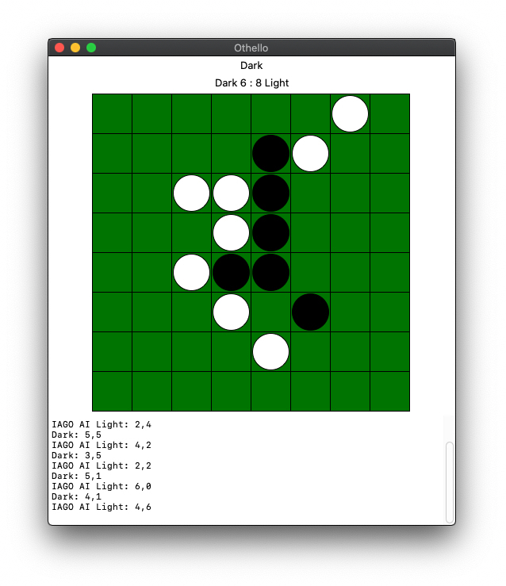

# othelloAI
Making IAGO, the Othello AI bot.

This was done as part of an AI course that delved into implementing algorithms for various AI problems. For this, I developed an ai Othello agent (aptly, `ai_agent.py`), which would be the brains for an Human (or Ai) vs AI bot match.

The agent uses various strategies for calculating its optimal next move - MiniMax and AlphaBeta pruning (with depth limiting) to look ahead at possible moves, state caching to reduce redundant calculations, and the development of node ordering heuristics to optimize choices. This provided an incredibly challenging opposition bot.

## Run
Simply run the shell script `run.sh` to launch a GUI for the game.

This script makes the call:
`python3 othello_gui.py -d 8 -a ai_agent.py -c -o -l 5`
  - `-d`: board size (ie 8x8)
  - `-a`: agent file location
  - `-c`: use caching
  - `-o`: use ordering heuristics
  - `-l`: depth limit (ie depth of 5). Reduce for less processing time and "easier" opponent.

## Play

The first player (the human in this case), will be playing dark coins, and has the name "IAGO AI" (the Othello killer). Select moves with the cursor. The dialog will show the moves made as coordinates, with "Invalid Move" displayed if a player selects an invalid spot. The score is kept at the top of the screen. The AI may timeout after a set time (to avoid lengthy stalled games) usually if the solution search depth is set too high. The game will end if the AI times out or no further moves can be made.
